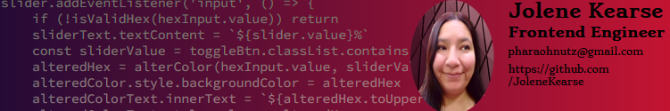

<div align="center">
  <h1>Jolene Kearse | Frontend Web Developer </h1>



I've stepped up my learning this past year with **JavaScript**. 🚀 I started off with **[Class Central](https://www.classcentral.com/report/javascript-and-webdev-bootcamps-fall-2022/)**'s Bootcamp based on **[FreeCodeCamp's Data Structures and Algorithms](https://www.freecodecamp.org/learn/javascript-algorithms-and-data-structures/)** curriculum.

I'm creating a solid foundation of JavaScript with **vanilla projects** and **[Codewars](https://www.codewars.com/)** katas. _(As of August 31st, 2022, I ranked up to 5 kyu!)_

This past month I quickly learned enough **React** to work with a team of developers and started in **open source** after getting inspired by **Hacktoberfest**.

<hr>

## 🏃‍♀️ Quick Facts About Me

- 🌍  I'm based in Southwestern Ontario, Canada 🇨🇦
- 🧠  I'm learning React using Vite and Yarn. I also brush up my SCSS skills whenever I get the chance.
- 🤝  I'm open to collaborating on **group projects**, **pair programming** and **open source**. I love getting more practice with the **team git workflow**. But the best thing is learning from other devs, discussing code, and teaching myself by explaining my thought process.
- ⚡  I was an English as a Foreign Language Teacher for 15+ years. I mainly lived in China, but also spent time in England, Canada and South Korea. There was actually one 6-month period where I lived on 3 different continents!
- 🥰 I'm addicted to _celebrating_ my **LinkedIn** connections' achievements and giving encouraging likes and Tweets on **Twitter**.
<hr>

## 🛠️ My Skills

_Hover over the icons to see additional info!_

#### Technologies I've Worked Tons With

Most of the projects are made with the **_big three_**: **JavaScript**, **HTML**, and **CSS**. I've now entered the _**React**-phase_, where I'm building everything with **Vite** and **Yarn**.

<p align="center">
<a href="https://developer.mozilla.org/en-US/docs/Web/JavaScript" target="_blank" rel="noreferrer"></a>
<a href="https://www.w3.org/TR/CSS/#css" target="_blank" rel="noreferrer"></a>
<a href="https://developer.mozilla.org/en-US/docs/Glossary/HTML5" target="_blank" rel="noreferrer"></a>
<a href="https://www.adobe.com/uk/products/photoshop.html" target="_blank" rel="noreferrer"></a>
<a href="https://reactjs.org/" target="_blank" rel="noreferrer"></a>
<a href="https://www.adobe.com/uk/products/photoshop.html" target="_blank" rel="noreferrer"></a>
</p>

#### Technologies I Have Some Experience With

I'm still learning **SCSS** in my free moments. I love **Python** and **Vue** and totally mean to get back into them after reaching the stage I'm comfortable with React. I use **Figma** to access designs and can do some cool things in **Illustrator** - even if I have to refer to my notes and/or guides!

<p align="center">
<a href="https://www.python.org/" target="_blank" rel="noreferrer"></a>
<a href="https://vuejs.org/" target="_blank" rel="noreferrer"></a>
<a href="https://sass-lang.com/" target="_blank" rel="noreferrer"></a>
<a href="adobe.com/uk/products/illustrator.html" target="_blank" rel="noreferrer"></a>
<a href="https://www.figma.com/" target="_blank" rel="noreferrer"></a>
</p>

<hr>

## 💻 My Developer Education

I'm **100% community-taught**, _which is my proffered term (rather than **self-taught**)_, meaning I've learned from so many excellent sources! My favourites are **[Scrimba](https://scrimba.com/)**, **[Dave Gray's YouTube channel](https://www.youtube.com/c/DaveGrayTeachesCode)**, and absolutely anything by **[Kevin Powell](https://www.kevinpowell.co/)**. My teaching background gave me the ability to assess learning materials and the discipline to chart my own path!

I started out after a quite stressful repatriation with just a phone and 7" tablet using apps like **Sololearn** and **Grasshopper** and **[FutureLearn](https://www.futurelearn.com/your-achievements)**'s amazing short courses. _I even won a contest here for designing a sample course for their platform!_ Then I found **Scrimba** to guide my path. Although I've learned the most here, I fit other courses in to cement my new-found knowledge and go deeper. **edX** and **Udemy** are perfect for that. To learn **JavaScript**, I followed **[Class Central](https://www.youtube.com/results?search_query=class+central+javascript)**'s Bootcamp using **FreeCodeCamp**'s curriculum. Then **[Codewars](https://www.codewars.com/)** to level up. Somewhere along the way, I advanced to the stage where I can just _read the docs_ on **[MDN](https://developer.mozilla.org/en-US//)** to find my own solutions.

<p align="center">
  <a href="https://scrimba.com/" target="_blank" rel="noreferrer"></a> <a href="https://www.freecodecamp.org/" target="_blank" rel="noreferrer"></a>  <a href="https://developer.mozilla.org/en-US//" target="_blank" rel="noreferrer"></a>  <a href="https://www.udemy.com/" target="_blank" rel="noreferrer"></a>  <a href="https://www.futurelearn.com/" target="_blank" rel="noreferrer"></a>  <a href="https://www.edx.org/" target="_blank" rel="noreferrer"></a>  <a href="https://www.coursera.org/" target="_blank" rel="noreferrer"></a>
</p>

<hr>

## 📣 My Socials

<p align="center"> <a href="https://www.linkedin.com/in/jolene-kearse-2562ba218/" target="_blank" rel="noreferrer"></a> <a href="https://www.twitter.com/FromJolene" target="_blank" rel="noreferrer"></a>  <a href="https://discord.com/users/Jolene#8258" target="_blank" rel="noreferrer"></a> <a href="https://www.codepen.io/EnglishWithJolene" target="_blank" rel="noreferrer"></a> <a href="https://www.github.com/JoleneKearse" target="_blank" rel="noreferrer"></a> </p>

<a href="https://www.twitter.com/FromJolene" target="_blank" rel="noreferrer"></a>

<hr>
  
## 🧮 My Stats

<a href="http://www.github.com/JoleneKearse"></a>

<a href="http://www.github.com/JoleneKearse"></a>

<a href="http://www.github.com/JoleneKearse"></a>

## 🔥 WakaTime Stats
<div>

<!--START_SECTION:waka-->

```text
Total Time: 13 hrs 26 mins

CSS          6 hrs 14 mins   ███████████▓░░░░░░░░░░░░░   46.48 %
Markdown     2 hrs 25 mins   ████▓░░░░░░░░░░░░░░░░░░░░   18.06 %
Go           2 hrs 24 mins   ████▒░░░░░░░░░░░░░░░░░░░░   17.88 %
HTML         1 hr 30 mins    ██▓░░░░░░░░░░░░░░░░░░░░░░   11.24 %
JavaScript   49 mins         █▓░░░░░░░░░░░░░░░░░░░░░░░   06.11 %
Git Config   1 min           ░░░░░░░░░░░░░░░░░░░░░░░░░   00.15 %
```

<!--END_SECTION:waka-->
</div>

## Holopin Badges

[](https://holopin.io/@pharaohnutz)
